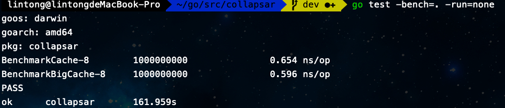
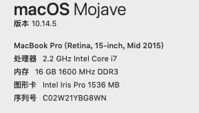

# collapsar

collapsar是线程安全的进程缓存库

## 使用Demo
```go
func main() {
    option := &Option{
		Length: 514,
	}
	cache := NewCache(option)
	oldValue, err := cache.AddWithTTL("test", 11, 3)
	val, err := cache.Get("test")
	if err != nil || val == nil || val.(int) != 11 {
		t.Errorf("check ttl timeout fail")
	}
}
```


## 性能对比
在同时插入100w条数据的情况下，二者具有相似的性能

和[bigcache](https://github.com/allegro/bigcache)进行简单的性能对比
```go
func BenchmarkCache(b *testing.B){
	option := &Option{
		Length: 1024,
	}
	cache := NewCache(option)
	values := []byte("bench_mark_test")
	b.ResetTimer()
	for i := 0; i < 1000000; i++ {
		cache.Add(fmt.Sprintf("test_%d", i), values)
	}

}

func BenchmarkBigCache(b *testing.B){
	cache, _ := bigcache.NewBigCache(bigcache.DefaultConfig(10 * time.Minute))
	values := []byte("bench_mark_test")
	b.ResetTimer()
	for i := 0; i < 1000000; i++ {
		cache.Set(fmt.Sprintf("test_%d", i), values)
	}
}

```
比对结果如下：



测试机器性能如下: 

